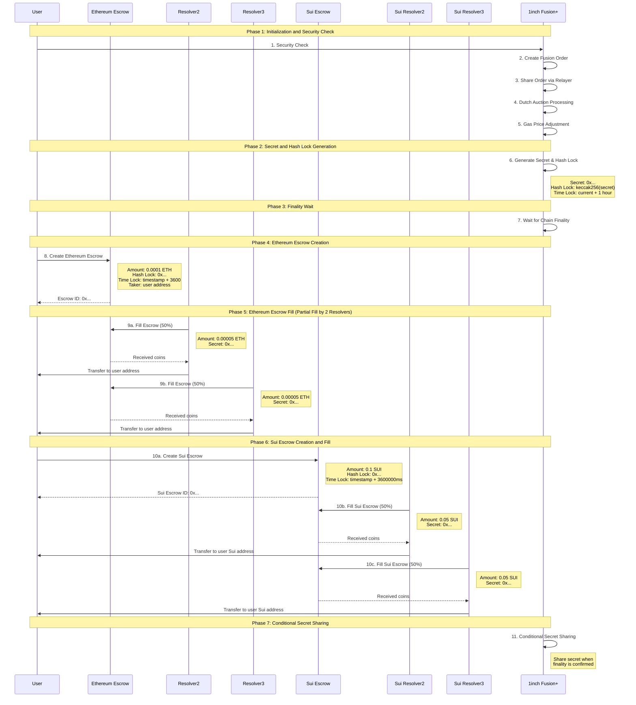

# SuiFusion+ (1inch Fusion+ integration Ethereum <> Sui)

A cross-chain atomic swap implementation between Ethereum Sepolia and Sui testnet, integrated with 1inch Fusion＋

## Overview

This project implements Hash-Time Lock Contract (HTLC) pattern for secure atomic swaps between Ethereum and Sui. The system supports partial fills by multiple resolvers and includes comprehensive security measures.

## Architecture

### Main Features

- **HTLC Atomic Swaps**
  - Assets are locked with a hashlock and timelock; funds move only if the secret is revealed, otherwise refunded after expiry.
  - Implemented in `EthereumEscrow.sol` (Solidity) and `cross_chain_escrow.move` (Move).

- **Intent-based Orders & Dutch Auction**
  - Makers create orders; resolvers compete to fill them. Dutch auction lowers rates over time for optimal execution.

- **Limit Order Protocol**
  - `LimitOrderProtocol.sol` manages orders, auctions, escrows, and resolver network.

- **Resolver Network**
  - `ResolverNetwork.sol` handles resolver registration, authorization, staking, and reputation.

- **Cross-chain Coordination**
  - Order hashes and secrets link escrows on both chains; Sui mirrors HTLC logic.

- **Partial Fill**
  - Orders can be filled in parts by multiple resolvers.

- **Recovery & Security**
  - Refunds after expiry; secret reuse is prevented; resolver penalties and reputation enforced.

---

### How it's made

#### Technical Structure

- **Solidity**: `CrossChainOrder.sol` (order/escrow integration), `EthereumEscrow.sol` (HTLC), `DutchAuction.sol` (auction), `LimitOrderProtocol.sol` (order logic), `ResolverNetwork.sol` (resolver management)
- **Move**: `cross_chain_escrow.move` (HTLC), `hash_lock.move` (hashlock), `time_lock.move` (timelock)

#### Flow Overview

1. **Order Creation**: User calls `createCrossChainOrder` with auction settings; order is registered and auction started.
2. **Escrow Setup**: HTLC escrows are created on both chains, locking assets with hashlock/timelock.
3. **Auction & Fill**: Resolvers monitor auction rates and fill orders when profitable; partial fills are tracked.
4. **Cross-chain & Secret Reveal**: Secret revealed on one chain unlocks funds on the other; verification is on-chain.
5. **Completion & Refund**: Correct secret transfers assets; after expiry, refunds are possible; resolver misbehavior is penalized.

#### Design Notes

- Off-chain relayers monitor both chains and relay secrets.
- Resolver safety: KYC/KYB, staking, reputation.
- All 1inch Fusion+ features (intent, auction, HTLC, partial fill, recovery, resolver network, security) are covered within smart contract scope.

### Cross-Chain Swap Flow

## License

MIT License
