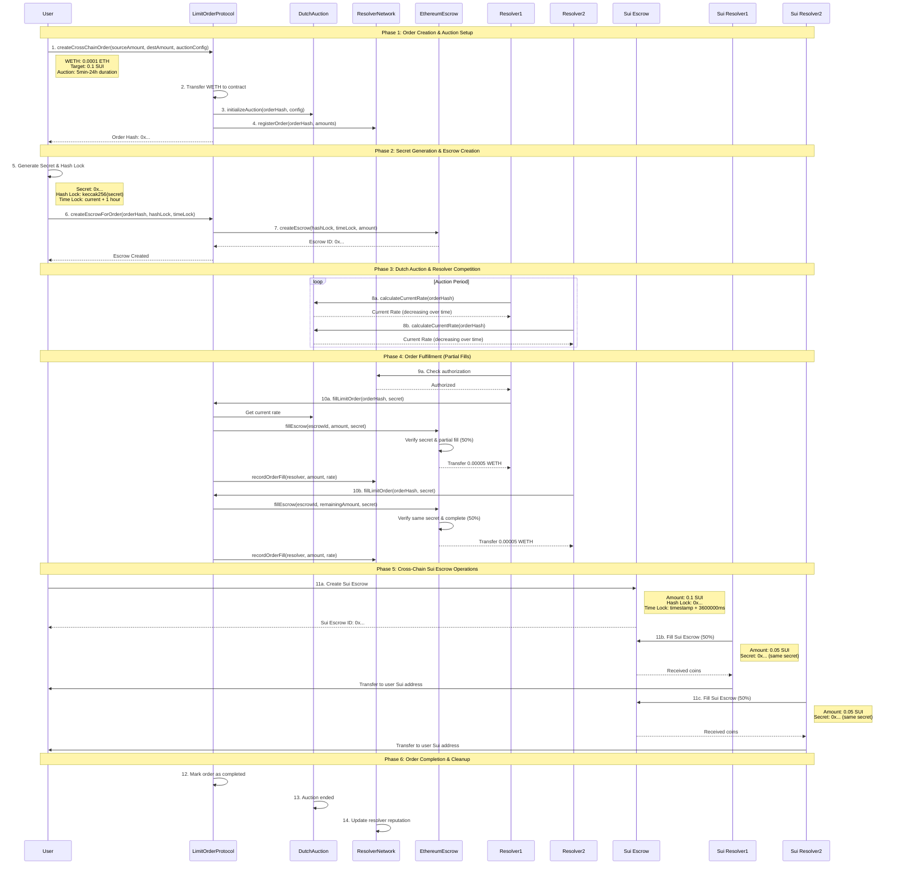

# SuiFusion+ (1inch Fusion+ integration Ethereum <> Sui)

A cross-chain atomic swap implementation between Ethereum Sepolia and Sui testnet, integrated with 1inch Fusion＋

## Overview

This project implements Hash-Time Lock Contract (HTLC) pattern for secure atomic swaps between Ethereum and Sui. The system supports partial fills by multiple resolvers and includes comprehensive security measures.

## Architecture

### Main Features

- **HTLC Atomic Swaps**
  - Assets are locked with a hashlock and timelock; funds move only if the secret is revealed, otherwise refunded after expiry.
  - Implemented in `EthereumEscrow.sol` (Solidity) and `cross_chain_escrow.move` (Move).

- **Intent-based Orders & Dutch Auction**
  - Makers create orders; resolvers compete to fill them. Dutch auction lowers rates over time for optimal execution.

- **Limit Order Protocol**
  - `LimitOrderProtocol.sol` manages orders, auctions, escrows, and resolver network.

- **Resolver Network**
  - `ResolverNetwork.sol` handles resolver registration, authorization, staking, and reputation.

- **Cross-chain Coordination**
  - Order hashes and secrets link escrows on both chains; Sui mirrors HTLC logic.

- **Partial Fill**
  - Orders can be filled in parts by multiple resolvers.

- **Recovery & Security**
  - Refunds after expiry; secret reuse is prevented; resolver penalties and reputation enforced.

---

### How it's made

#### Technical Structure

- **Solidity**: `CrossChainOrder.sol` (order/escrow integration), `EthereumEscrow.sol` (HTLC), `DutchAuction.sol` (auction), `LimitOrderProtocol.sol` (order logic), `ResolverNetwork.sol` (resolver management)
- **Move**: `cross_chain_escrow.move` (HTLC), `hash_lock.move` (hashlock), `time_lock.move` (timelock)

#### Flow Overview

1. **Order Creation & Auction Setup**: User calls `createCrossChainOrder` with WETH, target amount, and auction configuration. LimitOrderProtocol transfers WETH, initializes Dutch auction, and registers with ResolverNetwork.

2. **Secret Generation & Escrow Creation**: User generates secret and hash lock, then calls `createEscrowForOrder` to create HTLC escrow on Ethereum with time-locked funds.

3. **Dutch Auction & Resolver Competition**: Authorized resolvers monitor decreasing auction rates via `calculateCurrentRate`. Resolvers compete by filling orders when rates become profitable.

4. **Order Fulfillment with Partial Fills**: Resolvers call `fillLimitOrder` with the secret. EthereumEscrow verifies secrets and enables partial fills by multiple resolvers. Each fill transfers WETH proportionally.

5. **Cross-Chain Escrow Operations**: User creates corresponding Sui escrow with same hash lock. Sui resolvers use the same secret to claim SUI tokens, completing the atomic swap.

6. **Completion & Reputation Updates**: LimitOrderProtocol marks orders complete, DutchAuction ends, and ResolverNetwork updates resolver reputation based on performance.

### Cross-Chain Swap Flow

## License

MIT License
