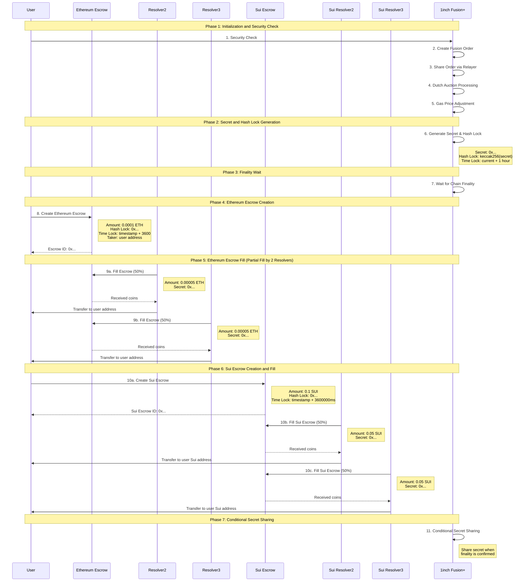

# Sepolia → Sui Cross-Chain Swap Architecture & Flow

This flow diagram shows the detailed process of Sepolia → Sui cross-chain swap integrated with 1inch Fusion+ features. Each phase includes important functions such as security, finality, partial fills, and conditional secret sharing.
